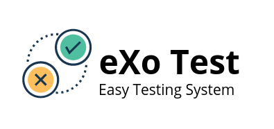

------------

## Install
`composer require overvoidjs/exotest:dev-master`
## Examples
- **include**:

``` php
<?php include_once 'vendor/autoload.php';
```

- **Test server code and content on response**

```php
$i = new Exo;

$url = 'https://google.com/';
//Testing code only
$i->is_ok($url);
//Testing code and content response
$i->is_ok($url, '<span>Каталог</span>');
```

- **Send POST with params**

```php
$i = new Exo;

$url = 'https://samesite.with/post/or/api';
$param = [
'param1'=>'param1_data',
'param2'=>'param2_data'
];

$test = $i->post_it($url,$param);
```

- **Send POST with params and file**

```php
$i = new Exo;

$url = 'https://vk.com/';

$payload = [
  'data'=>'data'
];

$post_file_name = 'new_img';
$post_file_path = './new_img.jpg';

$test = $i->post_it_file($url,$payload,$post_file_name,$post_file_path);
```


------------

- **[InWork] - test all pages in sitemap**

```php
$i = new Exo;

$sitemap = 'site.ru/sitemap.xml';
$limit = 200;

$i->sitemap_teser($sitemap);

//$i->sitemap_tester($sitemap,$limit);
```
